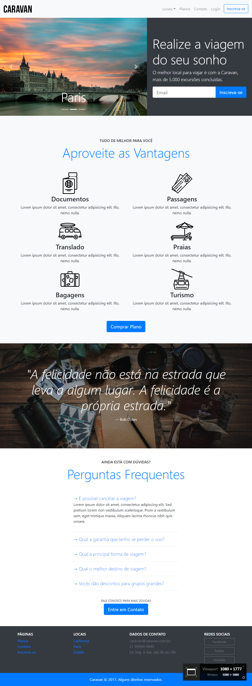

# Caravan

Este é um curso de _Bootstrap 4_. Nele você irá aprender o básico para conseguir utilizar os principais componentes do Framework.
Este curso se destina a quem já possui um conhecimento básico de CSS, incluindo o CSS Flexbox.
Nele vamos falar sobre Grid, Modal, Botões, Tipografia, Carrossel, Formulários e mais.

Projeto prático Caravan feito com Bootstrap 4 pelo site [Origamid](https://www.origamid.com/curso/bootstrap-4).

## Link do Projeto: [Caravan](https://marcelo-rafael.github.io/caravan/)

